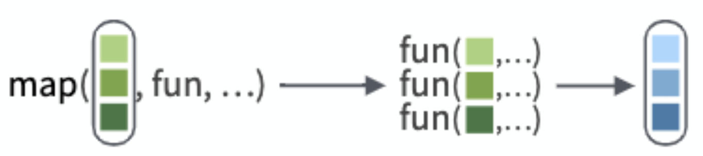
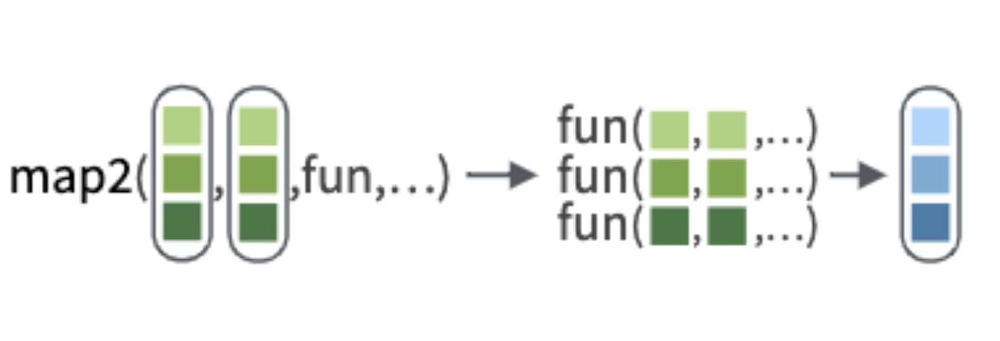
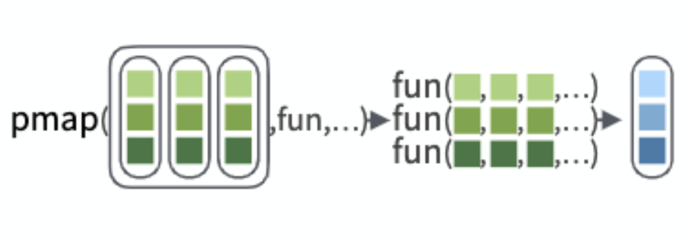
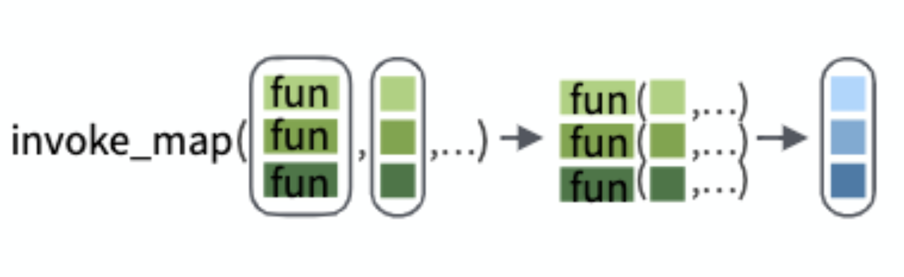

class: middle, center, middle

# Iteration

<br><br>.large[Maria C. Ramos| MiR Study Group | 5 Dec 2020]

<br><br><br>`r icon::fa("link")`.large[mariacramos.com]
<br><br>`r icon::fa("twitter")`.large[@mariacramosf]
---
class: top, left
```{r setup, include=FALSE}
options(htmltools.dir.version = FALSE)
knitr::opts_chunk$set(fig.retina = 3, warning = FALSE, message = FALSE)
```

# Outline

* vectors 

* why mapping?

* map()  overview

* map() variations

* map shortcuts

* expressions

* map2()

* pmap()

* invoke_map()

---
# Vectors 
.pull-left[
 ### simple
 
 * non-recursive vectors -every element is a single value and of the same type

```{r}
mynums <- c(1,2,3) 
mynums
class(mynums)
```

]

.pull-right[

###lists

* Recursive vectors - elements can be anything, even other vectors.

```{r}

mylist <- list(a = c(1,2,3), 
               b = c("a", "b", "c"))
mylist
class(mylist)
```

]

---

# purrr package

.center[**Iterate - apply a function to each element of a vector**]

<br>

* Easy to write

* Easy to read

* Can use with pipes

* Clear what type of output you'll get

* More consistent argument order

---
# map( ) overview

.center[**Iterate - apply a function to each element of a vector**]
--
<br>
map()
<br>

--
<br>
```{r, message=FALSE}
library(tidyverse)
```

---
# map( ) overview

```{r}
df <- tibble(
  a = c(1:3), 
  b = c(5,5,5), 
  d = c(5.88, 7.88, 8.96)
)
df
```

Take the mean of each element of the data frame

```{r, eval=FALSE}
mean(df$a)
mean(df$b)
mean(df$c)
```

---
# map( ) overview


```{r}
df

map(df, mean)
```
---
# map( ) overview
```{r, eval= FALSE}
map(df, mean)
```

map(vector, function)



.center[*nth element of the output is the result of applying the function to the nth element of the input vector*]

---
# map() overview

map(vector, function)

<br>
+ You can add extra arguments
<br>
map(vector, function, extraarg)
<br>

> should name the extra arguments

```{r}
map(df, mean, trim = 0.5)

```

---
# map ( ) overview

Use with pipes

```{r}
df %>%
  map(mean)
```

---
# map( ) variations

.center[
```{r, echo=FALSE}
dfn <- data.frame(map_function= c("map()", 
                               "map_chr()",
                               "map_dbl()", 
                               "map_dfc()", 
                               "map_dfr()",
                               "map_int()", 
                               "map_lgl()",
                               "walk"),
                  output_type=c("list", "character", "double", "data frame (cbind)", "data frame (rbind)", "integer", "logical", "side effect"))
dfn %>%
   knitr::kable("html")
```
]
---
# map( ) variations

.pull-left[
```{r}
map(df, mean)
```
]

.pull-right[
```{r}
map_dbl(df, mean)
```
]

---
# Expressions

* In reality, map works with functions, shortcuts, and expressions

## Expressions

```{r}
models <- mtcars %>% 
  split(.$cyl) %>% 
  map(~ lm(mpg ~ wt, data = .x))#<<

```
 * ~ means expression is coming
 <br>
 * replace the name of the thing to manipulate with .x wherever it appears
 
---
# map( ) shortcuts
```{r}
models
```

---
# map( ) shortcuts

work with every variation of map( )

.pull-left[
**name shortcut**
```{r}
models %>%
map("coefficients")#<<

```

]

.pull-right[
**integer shortcut**
```{r}
models %>%
  map(1)#<<
```

]
---
# map2( )

* Use when the arguments of the function are elements of 2 vectors

map2(vector1, vector2, function)



* Can pass extra arguments just as with map( )

* Same variants as map, according to the type of output

* For expressions, refer to elements of first vector as .x and elements of second vector as .y

---
# pmap ( )

* Use to map over 3 or more vectors

* Requires a single argument -> a list of vectors 

pmap(list(vector1, vector2, vector3), function)


* Same variations as map( ) and map2( ), according to the type of output

* For expressions, refer to elements of first vector as ..1, elements of second vector as ..2, and so on.

---
# invoke_map( )

* Iterate over a vector of functions followed by a vector of arguments 




---

# More resources

<br>

[Iteration Primers](https://rstudio.cloud/learn/primers/5)

[purrr Cheat Sheet](https://rstudio.cloud/learn/cheat-sheets)

[Advanced R - map functions](https://adv-r.hadley.nz/functionals.html)

[Jenny Bryan's purrr Tutorial](https://jennybc.github.io/purrr-tutorial/)

[Rebbeca Barter's purrr Tutorial](http://www.rebeccabarter.com/blog/2019-08-19_purrr/)

[Jannik Buhr's purrr Tutorial](https://jmbuhr.de/dataIntro20/lectures/lecture4/)

---
class: center, middle

# Thanks!

Slides created via the R package [**xaringan**](https://github.com/yihui/xaringan).
